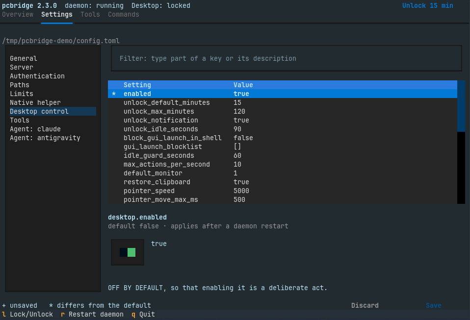
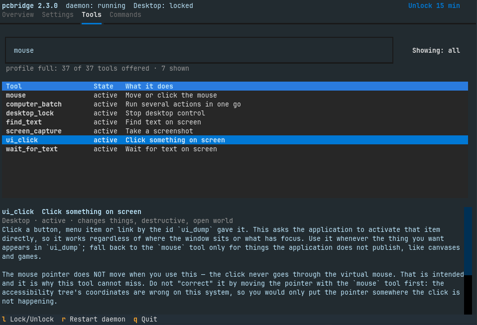

# pcbridge

[](https://github.com/Eymistaken/Pcbridge/actions/workflows/ci.yml)
[](https://github.com/Eymistaken/Pcbridge/actions/workflows/native.yml)
[](https://github.com/Eymistaken/Pcbridge/actions/workflows/package.yml)

**Turn a Linux desktop into an MCP server, and let an agent actually use it.**

pcbridge exposes one machine over the [Model Context Protocol](https://modelcontextprotocol.io).
A connected agent can hand work to terminal coding agents, drive a live
tmux session, run commands, read and write files, and, when explicitly
permitted, operate a GNOME or KDE Plasma desktop with a virtual keyboard,
pointer and screen reader.

> **Read [docs/security.md](docs/security.md) before installing.** pcbridge
> is remote code execution on your own desktop, by design.

## What it does

| | |
|---|---|
| **Delegate to coding agents** | Hand a task to Claude Code, Antigravity CLI or any CLI you configure; get a job id back at once. Jobs survive a daemon restart. |
| **Drive a live terminal** | Open a tmux session, type into it, read it back, answer an agent's prompts. |
| **Shell and files** | Commands in the foreground or background; read, write, search. |
| **Read the screen** | The accessibility tree as text (cheap, cannot miss), silent screenshots (screen sharing: no flash, no sound), or OCR as plain text. |
| **Use the desktop** | Virtual keyboard and pointer through uinput, absolute and relative motion, windows raised in ~5 ms through its GNOME extension, or through a KWin script on Plasma. |
| **Click what you see** | Every screenshot has an id; send the pixel you see plus the id, and pcbridge applies the monitor offset and scale. Any monitor layout, scale and rotation. |
| **Run it from a terminal** | `pcbridge` opens a terminal UI: every setting, the desktop grant with one Lock / Unlock button, all 37 tools with a search box, and a switch per MCP client; mouse and keyboard. Every part of it is also a plain command. |
| **Stay safe enough to leave on** | Desktop control is off by default; a time-limited grant that closes 90 s after the last action; nothing is sent behind a locked screen; a panel indicator (a lasting notification on Plasma) and a one-click kill switch. |

## Always ready

One resident daemon serves every client. Local clients (Claude Code,
Codex, Claude Desktop, Antigravity CLI, Hermes Agent, OpenCode, Pi,
oh-my-pi) run `pcbridge stdio`, a tiny relay to the daemon's
user-only Unix socket; systemd starts the daemon on the first connection.
Remote clients use HTTPS through Tailscale Funnel with OAuth 2.1.

```
 Claude Code / Codex / Claude Desktop ── pcbridge stdio ──► mcp.sock ──┐
 phone / web ── HTTPS ── Tailscale Funnel ── 127.0.0.1:8765 ───────────┼─► pcbridge daemon
                                                                       │   jobs in their own scopes
                                GNOME extension or KWin, native helper ┘   desktop: uinput, ScreenCast, AT-SPI
```

Measured on the reference machine (Zorin OS 18.1, GNOME 46, Wayland):

| | 1.x | 2.0 |
|---|---|---|
| New client to `tools/list` | 693 ms (a server per client) | 22-47 ms (daemon running), 693 ms (daemon started by the socket) |
| Relay overhead per call | - | ~0.1 ms |
| Memory | 92 MB per client | 14 MB relay + one 117 MB daemon |
| Screenshot, two monitors | 771 ms | 761 ms |
| `ui_dump` / `window_focus` | 32.7 / 29.7 ms | 26.7 / 25.5 ms |
| Daemon killed mid-call | - | retryable error in 10 ms, next call ok in 2 s |

More numbers, and why things are the way they are:
[docs/dev/measured-facts.md](docs/dev/measured-facts.md).

## Supported platforms

| | Status |
|---|---|
| Ubuntu 24.04, Zorin OS 18 (GNOME 46, Wayland) | tested daily |
| Arch Linux, KDE Plasma 6 (Wayland) | tested end to end in a VM; the package builds, installs and passes the suites in CI |
| Arch Linux, GNOME 50 (Wayland) | the extension and screen capture tested in a headless shell |
| Debian 13, Ubuntu 26.04 | the `.deb` builds, installs and passes the suites in CI |
| GNOME 47-49 on Wayland | expected to work, untested; `system_capabilities` reports it |
| X11, Plasma 5, other desktops | desktop tools refuse and say why; everything else works |
| Python | 3.12, 3.13, 3.14 |

## Install

```bash
# a release wheel, no root:
packaging/install-user.sh pcbridge-<version>-py3-none-linux_x86_64.whl --yes
# or the package for your release:
sudo apt install ./pcbridge_<version>_<distro>_amd64.deb && pcbridge setup
# or on Arch, from a checkout:
(cd packaging/arch && makepkg -si) && pcbridge setup
# or from git:
git clone https://github.com/Eymistaken/Pcbridge.git && cd Pcbridge && ./install.sh
```

`pcbridge setup` writes the config, enables the socket and service,
installs the GNOME extension (on Plasma: authorizes the native helper for
KWin screenshots), registers Claude Code, Codex and Claude
Desktop, and checks that a fresh client works. Details:
[docs/install.md](docs/install.md).

## Quick start

```bash
pcbridge                 # the terminal UI: settings, the desktop grant, the tools
pcbridge list            # every command, for work without the UI
pcbridge clients         # which agents and apps can use pcbridge; connect / disconnect NAME
pcbridge status          # daemon, grant, jobs, remote tunnel
pcbridge doctor          # every check, with the fix next to each problem
```

Then, in any connected client, ask for work: "run the tests in ~/src/app
with Claude Code", "what is on my screen", "open Text Editor and type
hello". Desktop control needs `[desktop] enabled = true` once; the agent
then opens a time-limited grant by itself with `desktop_unlock`.

Kill switch: `pcbridge lock` (alias `bridgekilit`), "Lock now" in the
terminal UI, the panel icon's "Lock desktop control now" on GNOME, or the
grant notification's "Lock now" on Plasma.

## The terminal UI

`pcbridge` alone in a terminal opens it, in the terminal's own colors:



- **The bar at the top** shows the daemon and the desktop grant on every
  tab. Its button locks or unlocks the grant; `l` locks at once and asks
  before it unlocks.
- **Settings** edits every setting with the right control for its type.
  Save checks the file with the daemon's own loader, backs up the old one
  and writes only the changed lines; the password and the token are never
  shown. Its **Panel icon** section changes the GNOME icon immediately,
  without a daemon restart; KDE Plasma explains that it has no pcbridge icon.
- **Tools** lists all 37 tools, marks what the `[tools] profile` offers
  and searches names and descriptions as you type.

- **Connections** has a switch for each MCP client pcbridge knows: Claude
  Code, Codex, Claude Desktop, Antigravity CLI, Hermes Agent, OpenCode, Pi
  and oh-my-pi. Where a client can switch an entry off, disconnecting keeps
  its settings; every changed file is backed up.
- **Without the UI**: `pcbridge settings`, `get`, `set`, `reset`, `tools`,
  `clients`, `connect`, `disconnect`, `restart`; `pcbridge list` shows them all. Piped or scripted, `pcbridge`
  alone prints the help, so nothing that calls it changes.



## Documentation

| | |
|---|---|
| [docs/install.md](docs/install.md) | Install, update, remote access |
| [docs/usage.md](docs/usage.md) | The 37 tools, which need the grant, how to drive the screen; the terminal UI and every command |
| [docs/configuration.md](docs/configuration.md) | The config file and `pcbridge set`; the reference is [config.example.toml](config.example.toml) |
| [docs/security.md](docs/security.md) | What protects the machine, and what does not |
| [docs/troubleshooting.md](docs/troubleshooting.md) | Symptoms and fixes |
| [docs/architecture.md](docs/architecture.md) | Daemon, relay, layers, the native helper |
| [docs/dev/contributing.md](docs/dev/contributing.md) | Tests, live-test flags, adding tools and agents |
| [docs/dev/measured-facts.md](docs/dev/measured-facts.md) | What was measured, with the numbers |
| [docs/dev/desktop-rules.md](docs/dev/desktop-rules.md) | How the desktop tools must behave |
| [docs/native/](docs/native/) | The Rust helper: protocol, capture, packaging |
| [gnome-extension/README.md](gnome-extension/README.md) | The GNOME Shell extension |
| [CHANGELOG.md](CHANGELOG.md), [ROADMAP.md](ROADMAP.md) | What changed, what is open |

## License

See [LICENSE](LICENSE).
